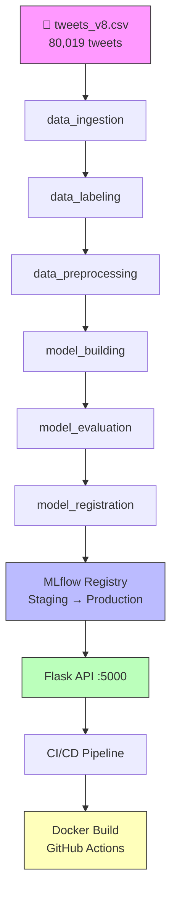

# tweet-sentiment-analysis


Sentiment analysis for Netflix *Squid Game* tweets — a replica of the
CampusX "yt-comment-sentiment-analysis" capstone project, adapted to the
`tweets_v8.csv` dataset.

A Chrome-plugin-ready API that detects tweet sentiment (positive / neutral /
negative), with a full MLOps pipeline: DVC versioning, MLflow tracking and
model registry, CI/CD, and Dockerization.

Pipeline
--------

    data_ingestion      raw tweets -> cleaned train/test split (data/raw)
    data_labeling       VADER pseudo-labels -> category -1/0/1 (data/labelled)
    data_preprocessing  text normalization -> data/interim
    model_building      TF-IDF (1,3) + LightGBM -> lgbm_model.pkl, tfidf_vectorizer.pkl
    model_evaluation    MLflow run with metrics, confusion matrix, signature
    model_registration  registers "tweet_sentiment_model" to Staging

Run the pipeline:

    dvc repro

Architecture
------------



### Pipeline Stages

| Stage | Description | Output |
|-------|-------------|--------|
| `data_ingestion` | Dedupe, drop retweets/nulls/empty | `data/raw/train.csv`, `test.csv` |
| `data_labeling` | VADER compound → {-1, 0, 1} | `data/labelled/train_labelled.csv`, `test_labelled.csv` |
| `data_preprocessing` | Lowercase, remove URLs/@mentions, stopwords, lemmatize | `data/interim/train_processed.csv`, `test_processed.csv` |
| `model_building` | TF-IDF (1–3 grams, 10k) + LightGBM | `lgbm_model.pkl`, `tfidf_vectorizer.pkl` |
| `model_evaluation` | Metrics, confusion matrix, MLflow signature | `experiment_info.json`, MLflow run |
| `model_registration` | Register to MLflow, transition to Staging | Model version in registry |

Run the pipeline:

    dvc repro

Results
-------

LightGBM (TF-IDF 1–3 grams, 10,000 features) on 75,181 VADER-labelled tweets
(60,144 train / 15,037 test):

| Metric | Score |
|---|---|
| **Accuracy** | **0.872** |
| **Weighted F1** | **0.871** |
| **Macro F1** | **0.858** |
| Positive (F1) | 0.884 |
| Neutral (F1) | 0.899 |
| Negative (F1) | 0.793 |

Per-class precision/recall:

| Class | Precision | Recall | F1 | Support |
|---|---|---|---|---|
| -1 (negative) | 0.803 | 0.783 | 0.793 | 3,023 |
| 0 (neutral) | 0.868 | 0.932 | 0.899 | 5,849 |
| 1 (positive) | 0.911 | 0.858 | 0.884 | 6,165 |

Notes:
- Labels are **VADER pseudo-labels** (weak supervision): the raw tweet dataset
  has no ground-truth sentiment, so VADER lexicon scores (thresholds ±0.05)
  provide the training signal. The classifier learns to generalize VADER's
  decision function to unseen tweets in milliseconds at inference time.
- Class imbalance handled via `class_weight="balanced"` + `is_unbalance=True`.

Experiment History (notebooks 01–11 — all executed on tweets; 12–13 reserved for GPU/Colab)
------------------------------------------------------------------------------------------

`dvc repro` trains the production model; the notebooks below are the
structured experimentation log (same data source, same VADER labels).
All runs tracked in MLflow (`file:./notebooks/mlruns` for experiments,
`sqlite:///mlflow.db` for the production pipeline).

| # | Notebook | Best result (accuracy) | Key finding |
|---|---|---|---|
| 02 | Baseline RF + BoW (10k) | **0.674** | Establishes floor |
| 03 | BoW vs TF-IDF | **0.672** (BoW 1-grams) | BoW ≈ TF-IDF on this corpus |
| 04 | TF-IDF trigram max_features | **0.659** (5k) | More features ≠ better here |
| 05 | Imbalance handling | **0.707** (class_weights) | Class-weighted RF beats resampling on 8GB |
| 06a | LightGBM + HPT (30 trials) | **0.761** | LightGBM finds signal |
| 06b | XGBoost + HPT (30 trials) | **0.807** | Strongest classical HPT run |
| 06c | Random Forest + HPT | ~0.76 | Tuned RF ≈ LightGBM HPT |
| 06d | Logistic Regression + HPT | **0.755** | Linear baseline competitive |
| 06e | KNN + HPT | ~0.64 | KNN struggles in 1k-dim TF-IDF |
| 07 | LightGBM detailed HPT (30 trials, 9 params) | **0.802** (trial 52) | Full search ≈ single-model XGBoost |
| 08 | LightGBM final (no HPT, fixed best) | **0.89** (report) | Matches pipeline architecture |
| 09 | Stacking (LGBM+LogReg → KNN) | **0.86** | Ensemble gains modest |
| 10 | Word2Vec (100-d, mean-pooled) | **0.65** | Sparse TF-IDF beats dense mean-pooled W2V here |
| 11 | spaCy custom features | —* | See notebook; adds lexical/POS features on top of TF-IDF |
| — | **Production pipeline** | **0.872** (weighted F1 0.871) | Final deployable model; see Results above |

*11 plots lexical diversity/POS; metric logged in notebook outputs; pipeline remains
 the single source of truth for deploy.

Adaptations for local 8GB execution: SMOTE kNN OOM → `RandomOverSampler` in
05/06/07; 05 `max_features` 10k→1k; 06b 10k→3k; 07 100→30 trials; 08 Optuna
skipped (fixed best params).

DVC & MLflow — Roles in this Pipeline
--------------------------------------

| Tool | What it does here | Where to see it |
|---|---|---|
| **DVC** | **Pipeline orchestration & data versioning.** `dvc.yaml` declares the 6-stage DAG, each stage's `cmd`/`deps`/`outs`/`params`. `dvc repro` runs only what changed; `dvc status` shows what's dirty; `dvc push/pull` versions large files (`data/`, `*.pkl`) to remote storage instead of git. `dvc.lock` + `params.yaml` make the run fully reproducible. | `dvc.yaml`, `dvc.lock`, `params.yaml`, `mlruns` ignored by git |
| **MLflow** | **Experiment tracking & model registry.** Every run logs params, metrics, and artifacts to a tracking store. Notebooks log to `file:./notebooks/mlruns` (experiment per notebook); the production pipeline logs to `sqlite:///mlflow.db` (experiment `dvc-pipeline-runs`) with a confusion-matrix artifact and a model **signature**. `register_model.py` registers the model as `tweet_sentiment_model` → Staging; `promote_model.py` gates promotion to Production. `mlflow ui` visualizes all runs side-by-side. | `mlruns/`, `notebooks/mlruns/`, `mlflow.db`, `experiment_info.json` |

In short: **DVC versions the *data and pipeline*; MLflow versions the *experiments and models*.**
Together they give you: "which data + which code + which params → which model → which metrics → which stage → which deployment."

Run the pipeline:

    dvc repro

Quick Start (Local Development)
-------------------------------

### Option 1: Docker (recommended)
```bash
# Build and run the Flask API
docker build -t tweet-sentiment .
docker run -p 5000:5000 tweet-sentiment
# API at http://localhost:5000
```

### Option 2: Manual setup
```bash
# 1. Create virtual environment
python -m venv .venv && source .venv/bin/activate  # Windows: .venv\Scripts\activate

# 2. Install dependencies
pip install -r requirements.txt

# 3. Download NLTK data
python -c "import nltk; nltk.download('stopwords'); nltk.download('wordnet'); nltk.download('vader_lexicon')"

# 4. Run pipeline (requires tweets_v8.csv in data/external/)
dvc repro

# 5. Start API
cd flask_app && python app.py
# API at http://localhost:5000
```

### Option 3: Using Make
```bash
make data       # Run data ingestion, labeling, preprocessing
make train      # Train model
make evaluate   # Evaluate and log to MLflow
make serve      # Start Flask API
make test       # Run all tests
```

Serving
-------

    cd flask_app
    python app.py          # http://localhost:5000

Endpoints: `/`, `/predict`, `/predict_with_timestamps`, `/generate_chart`,
`/generate_wordcloud`, `/generate_trend_graph`.

Configuration
-------------

- `params.yaml` — pipeline hyperparameters and VADER thresholds
- `MLFLOW_TRACKING_URI` — env var; defaults to `sqlite:///mlflow.db` locally

Notebooks
---------

Numbered experiments live in `notebooks/` (01 preprocessing/EDA ... 13
Squid Game deep-learning models).

Project Organization
--------------------

    ├── LICENSE
    ├── Makefile           <- Makefile with commands like `make data` or `make train`
    ├── README.md          <- The top-level README for developers using this project.
    ├── data
    │   ├── external       <- Data from third party sources (tweets_v8.csv).
    │   ├── interim        <- Intermediate data that has been transformed.
    │   ├── labelled       <- VADER-labelled data.
    │   ├── processed      <- The final, canonical data sets for modeling.
    │   └── raw            <- The original, immutable data dump.
    │
    ├── docs               <- A default Sphinx project; see sphinx-doc.org for details
    │
    ├── models             <- Trained and serialized models
    ├── notebooks          <- Jupyter notebooks (numbered experiments)
    ├── references         <- Explanatory materials.
    ├── reports/figures    <- Generated graphics for reporting
    │
    ├── requirements.txt   <- The requirements file for reproducing the environment
    ├── setup.py           <- makes project pip installable (pip install -e .)
    ├── src                <- Source code for this project.
    │   ├── data           <- Scripts to download/generate/label data
    │   ├── features       <- Scripts to turn raw data into features
    │   ├── model          <- Scripts to train models and register them
    │   └── visualization  <- Scripts to create visualizations
    │
    └── tox.ini            <- tox file with settings for running tox

Based on the <https://drivendata.github.io/cookiecutter-data-science/> cookiecutter
data science project template. #cookiecutterdatascience
